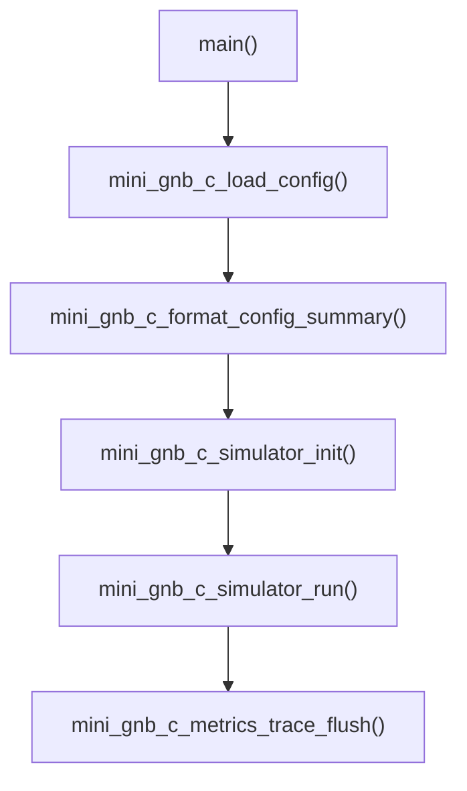
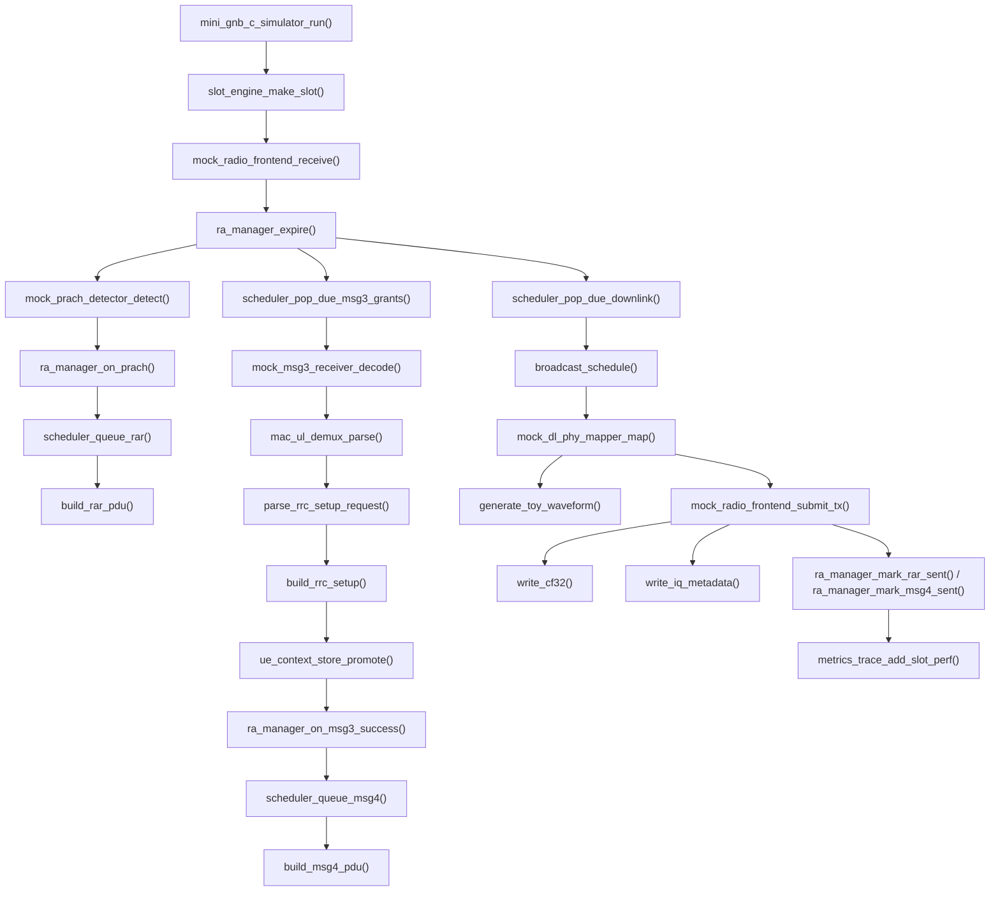
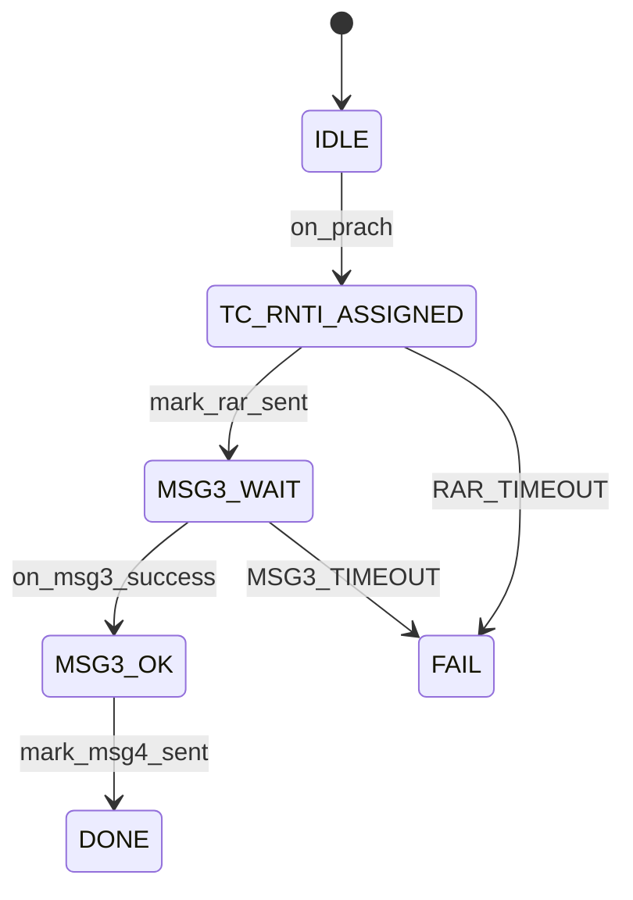

# gnb_c Architecture

## 1. Overview

`gnb_c` is a C implementation of the minimal gNB prototype in this repository.

Its design target is:

- single process
- single thread
- single cell
- single UE
- mock PHY/RF
- initial access closure from Msg1 to Msg4

It is not designed as a production gNB. Instead, it is a small bring-up baseline that keeps the same logical decomposition as a gNB:

- configuration
- timing
- broadcast
- random access
- uplink decode
- MAC/RRC parsing
- downlink scheduling
- PHY mapping
- radio output
- metrics and trace

The most important architectural feature is:

**the whole system is slot-driven by one top-level simulator loop.**

There are no threads, no locks, and no asynchronous queues in the current implementation.

## 2. Top-Level Shape

The entrypoint is:

- `apps/mini_gnb_c_sim.c`

The top-level composition root is:

- `include/mini_gnb_c/common/simulator.h`

The main control loop is:

- `src/common/simulator.c`

The simulator object directly owns all major modules:

- `config`
- `metrics`
- `slot_engine`
- `radio`
- `broadcast`
- `prach_detector`
- `ra_manager`
- `scheduler`
- `msg3_receiver`
- `dl_mapper`
- `ue_store`

So the code architecture is a **composition-based modular design**, not inheritance and not callback-driven orchestration.

## 3. Directory Layout

- `apps/`
  - executable entrypoint
- `config/`
  - static YAML configuration
- `include/mini_gnb_c/`
  - public headers grouped by subsystem
- `src/`
  - subsystem implementations
- `tests/`
  - unit tests and integration test

Subsystem mapping:

- `config`
  - config loading and summary formatting
- `timing`
  - slot generation and frame timing abstraction
- `broadcast`
  - SSB and SIB1 scheduling and payload generation
- `ra`
  - RA state machine
- `scheduler`
  - pending RAR, Msg3 UL grants, Msg4 DL grants
- `phy_ul`
  - mock PRACH detect and mock Msg3 decode
- `mac`
  - Msg3 MAC PDU demux
- `rrc`
  - minimal RRC CCCH parser/builder
- `phy_dl`
  - toy DL waveform mapping
- `radio`
  - mock RX/TX and IQ export
- `ue`
  - minimal UE context store
- `metrics`
  - trace, counters, performance metrics, summary files

## 4. Main Startup Path

The startup path is short and explicit:

1. `main()` in `apps/mini_gnb_c_sim.c`
2. `mini_gnb_c_load_config()`
3. `mini_gnb_c_format_config_summary()`
4. `mini_gnb_c_simulator_init()`
5. `mini_gnb_c_simulator_run()`

This means the program has two top-level phases:

- initialization
- slot-by-slot execution

### 4.1 Startup Call Graph

## 5. Core Runtime Model

The runtime model is:

- one loop over `abs_slot`
- each slot is converted to `sfn.slot`
- every subsystem is driven synchronously from that slot

This is implemented in:

- `src/common/simulator.c`

The slot loop performs:

1. create slot context
2. receive mock radio burst
3. expire old RA context if needed
4. detect PRACH
5. create and queue RAR if PRACH exists
6. pop due Msg3 UL grants
7. decode Msg3
8. MAC demux
9. parse RRCSetupRequest
10. build RRCSetup
11. promote UE context
12. schedule Msg4
13. pop due DL grants
14. add broadcast grants
15. map DL grants into patches and IQ samples
16. submit TX and export IQ
17. mark RAR sent or Msg4 sent
18. collect slot performance
19. flush summary after loop end

## 6. Main Execution Flow

### 6.1 Overall Flow

### 6.2 Msg1 to Msg4 Logic

The current implementation models the access procedure as:

- Msg1
  - PRACH detection
- Msg2
  - RAR build and scheduling
- Msg3
  - mock PUSCH/UL-SCH decode
  - MAC parse
  - RRCSetupRequest parse
- Msg4
  - build contention resolution identity + RRCSetup
  - schedule DL object and transmit

## 7. Key Data Structures

Most important shared types are defined in:

- `include/mini_gnb_c/common/types.h`

### 7.1 Configuration Types

- `mini_gnb_c_cell_config_t`
- `mini_gnb_c_prach_config_t`
- `mini_gnb_c_rf_config_t`
- `mini_gnb_c_broadcast_config_t`
- `mini_gnb_c_sim_config_t`
- `mini_gnb_c_config_t`

These are loaded once at startup by:

- `mini_gnb_c_load_config()`

### 7.2 Runtime Context Types

- `mini_gnb_c_slot_indication_t`
  - current slot abstraction
- `mini_gnb_c_prach_indication_t`
  - PRACH detection result
- `mini_gnb_c_ul_grant_for_msg3_t`
  - Msg3 UL scheduling info
- `mini_gnb_c_dl_grant_t`
  - DL object scheduling info
- `mini_gnb_c_msg3_decode_indication_t`
  - Msg3 decode result
- `mini_gnb_c_mac_ul_parse_result_t`
  - decoded MAC subPDU structure
- `mini_gnb_c_rrc_setup_request_info_t`
  - parsed RRCSetupRequest fields
- `mini_gnb_c_rrc_setup_blob_t`
  - encoded RRCSetup payload
- `mini_gnb_c_ra_context_t`
  - active RA state
- `mini_gnb_c_ue_context_t`
  - promoted UE context
- `mini_gnb_c_tx_grid_patch_t`
  - DL PHY patch with toy waveform samples
- `mini_gnb_c_run_summary_t`
  - final execution summary

### 7.3 Why These Types Matter

The system passes these structs from module to module instead of using hidden global state.

That gives the implementation three good properties:

- explicit data flow
- easy testing
- clear ownership boundaries

## 8. Module Responsibilities

### 8.1 Config Layer

Files:

- `src/config/config_loader.c`

Key functions:

- `mini_gnb_c_load_config()`
- `mini_gnb_c_format_config_summary()`

Responsibility:

- load static YAML
- fill `mini_gnb_c_config_t`
- format startup summary text

This layer is read-only after startup.

### 8.2 Timing Layer

Files:

- `src/timing/slot_engine.c`

Key functions:

- `mini_gnb_c_slot_engine_init()`
- `mini_gnb_c_slot_engine_make_slot()`

Responsibility:

- map `abs_slot` to `sfn.slot`
- generate slot timing fields
- mark whether the slot has SSB, SIB1, PRACH opportunity

This is the heartbeat of the whole prototype.

### 8.3 Broadcast Layer

Files:

- `src/broadcast/broadcast_engine.c`

Key functions:

- `mini_gnb_c_broadcast_engine_init()`
- `mini_gnb_c_broadcast_schedule()`
- `mini_gnb_c_build_mib()`
- `mini_gnb_c_build_sib1()`

Responsibility:

- generate MIB-like payload text
- generate SIB1-like payload text
- insert SSB and SIB1 into current DL schedule

### 8.4 PRACH Detection Layer

Files:

- `src/phy_ul/mock_prach_detector.c`

Key functions:

- `mini_gnb_c_mock_prach_detector_init()`
- `mini_gnb_c_mock_prach_detector_detect()`

Responsibility:

- inject one simulated PRACH event at configured slot

This is currently deterministic and controlled by config.

### 8.5 RA State Machine

Files:

- `src/ra/ra_manager.c`

Key functions:

- `mini_gnb_c_ra_manager_init()`
- `mini_gnb_c_ra_manager_on_prach()`
- `mini_gnb_c_ra_manager_mark_rar_sent()`
- `mini_gnb_c_ra_manager_on_msg3_success()`
- `mini_gnb_c_ra_manager_mark_msg4_sent()`
- `mini_gnb_c_ra_manager_expire()`

Responsibility:

- own the single active RA context
- allocate `tc_rnti`
- derive `rar_abs_slot`
- derive `msg3_expect_abs_slot`
- derive `msg4_abs_slot`
- track RA state transitions
- detect RAR timeout and Msg3 timeout

This is the control core of the access flow.

### 8.6 Initial Access Scheduler

Files:

- `src/scheduler/initial_access_scheduler.c`

Key functions:

- `mini_gnb_c_initial_access_scheduler_init()`
- `mini_gnb_c_initial_access_scheduler_queue_rar()`
- `mini_gnb_c_initial_access_scheduler_queue_msg4()`
- `mini_gnb_c_initial_access_scheduler_pop_due_downlink()`
- `mini_gnb_c_initial_access_scheduler_pop_due_msg3_grants()`

Responsibility:

- keep pending DL objects
- keep pending Msg3 UL grants
- convert RA requests into scheduled objects
- build RAR via `mini_gnb_c_build_rar_pdu()`
- build Msg4 via `mini_gnb_c_build_msg4_pdu()`

This is intentionally not a generic scheduler. It only supports:

- RAR
- Msg3 UL grant
- Msg4

### 8.7 Msg3 Receiver

Files:

- `src/phy_ul/mock_msg3_receiver.c`

Key functions:

- `mini_gnb_c_mock_msg3_receiver_init()`
- `mini_gnb_c_mock_msg3_receiver_decode()`

Responsibility:

- create a simulated Msg3 MAC PDU
- optionally include C-RNTI CE
- include UL-CCCH SDU
- control CRC result and quality fields

This is the current substitute for real PUSCH/UL-SCH decoding.

### 8.8 MAC UL Demux

Files:

- `src/mac/mac_ul_demux.c`

Key function:

- `mini_gnb_c_mac_ul_demux_parse()`

Responsibility:

- parse Msg3 MAC PDU subheaders
- identify C-RNTI CE
- identify UL-CCCH SDU
- track LCID sequence

### 8.9 RRC CCCH Stub

Files:

- `src/rrc/rrc_ccch_stub.c`

Key functions:

- `mini_gnb_c_parse_rrc_setup_request()`
- `mini_gnb_c_build_rrc_setup()`

Responsibility:

- parse `RRCSetupRequest`
- build a minimal `RRCSetup`

This is intentionally only a thin shell.

### 8.10 UE Context Store

Files:

- `src/ue/ue_context_store.c`

Key functions:

- `mini_gnb_c_ue_context_store_init()`
- `mini_gnb_c_ue_context_store_promote()`
- `mini_gnb_c_ue_context_store_mark_rrc_setup_sent()`

Responsibility:

- create minimal UE context only after Msg3 success
- copy contention identity into UE context
- mark when Msg4 was sent

The implementation deliberately follows the design choice:

**do not create a formal UE context at Msg1. Promote only after Msg3 is valid.**

### 8.11 DL PHY Mapper

Files:

- `src/phy_dl/mock_dl_phy_mapper.c`

Key functions:

- `mini_gnb_c_mock_dl_phy_mapper_init()`
- `mini_gnb_c_mock_dl_phy_mapper_map()`
- `mini_gnb_c_generate_toy_waveform()`

Responsibility:

- convert DL grants into `mini_gnb_c_tx_grid_patch_t`
- fill metadata such as PRB, symbol span, object type
- generate a toy OFDM-like waveform
- store complex samples into patch buffers

This is not full NR baseband generation. It is a minimal mock physical waveform pipeline.

### 8.12 Radio Layer

Files:

- `src/radio/mock_radio_frontend.c`

Key functions:

- `mini_gnb_c_mock_radio_frontend_init()`
- `mini_gnb_c_mock_radio_frontend_receive()`
- `mini_gnb_c_mock_radio_frontend_submit_tx()`
- `mini_gnb_c_write_cf32()`
- `mini_gnb_c_write_iq_metadata()`

Responsibility:

- simulate RX timestamp input
- accept DL patches
- count TX bursts
- export `.cf32` IQ files
- export sidecar `.json` metadata

The radio layer is where the toy waveform becomes an actual file artifact.

### 8.13 Metrics Layer

Files:

- `src/metrics/metrics_trace.c`

Key functions:

- `mini_gnb_c_metrics_trace_init()`
- `mini_gnb_c_metrics_trace_increment_named()`
- `mini_gnb_c_metrics_trace_event()`
- `mini_gnb_c_metrics_trace_add_slot_perf()`
- `mini_gnb_c_metrics_trace_flush()`

Responsibility:

- counters
- structured trace events
- slot performance records
- summary export
- JSON output files

Produced artifacts:

- `out/trace.json`
- `out/metrics.json`
- `out/summary.json`

## 9. Detailed Function Call Relationships

### 9.1 Initialization Relationships

`mini_gnb_c_simulator_init()` calls:

- `mini_gnb_c_metrics_trace_init()`
- `mini_gnb_c_slot_engine_init()`
- `mini_gnb_c_mock_radio_frontend_init()`
- `mini_gnb_c_broadcast_engine_init()`
- `mini_gnb_c_mock_prach_detector_init()`
- `mini_gnb_c_ra_manager_init()`
- `mini_gnb_c_initial_access_scheduler_init()`
- `mini_gnb_c_mock_msg3_receiver_init()`
- `mini_gnb_c_mock_dl_phy_mapper_init()`
- `mini_gnb_c_ue_context_store_init()`

### 9.2 PRACH to RAR Relationships

Inside one slot:

1. `mini_gnb_c_mock_prach_detector_detect()`
2. `mini_gnb_c_ra_manager_on_prach()`
3. `mini_gnb_c_initial_access_scheduler_queue_rar()`
4. `mini_gnb_c_build_rar_pdu()`

Meaning:

- detector finds Msg1
- RA manager creates state
- scheduler creates Msg2 and Msg3 UL grant
- builder serializes RAR payload

### 9.3 Msg3 to Msg4 Relationships

1. `mini_gnb_c_initial_access_scheduler_pop_due_msg3_grants()`
2. `mini_gnb_c_mock_msg3_receiver_decode()`
3. `mini_gnb_c_mac_ul_demux_parse()`
4. `mini_gnb_c_parse_rrc_setup_request()`
5. `mini_gnb_c_build_rrc_setup()`
6. `mini_gnb_c_ue_context_store_promote()`
7. `mini_gnb_c_ra_manager_on_msg3_success()`
8. `mini_gnb_c_initial_access_scheduler_queue_msg4()`
9. `mini_gnb_c_build_msg4_pdu()`

Meaning:

- Msg3 grant becomes decoded MAC payload
- MAC payload becomes CCCH message
- CCCH message becomes request info
- request info becomes RRCSetup
- RA context becomes UE context
- RA manager decides Msg4 slot
- scheduler stores Msg4 DL object

### 9.4 DL Transmission Relationships

1. `mini_gnb_c_initial_access_scheduler_pop_due_downlink()`
2. `mini_gnb_c_broadcast_schedule()`
3. `mini_gnb_c_mock_dl_phy_mapper_map()`
4. `mini_gnb_c_generate_toy_waveform()`
5. `mini_gnb_c_mock_radio_frontend_submit_tx()`
6. `mini_gnb_c_write_cf32()`
7. `mini_gnb_c_write_iq_metadata()`

Meaning:

- all DL objects due in current slot are gathered
- broadcast objects are appended
- DL objects are mapped into transmission patches
- toy waveform is synthesized
- radio layer exports IQ files

### 9.5 Post-TX State Updates

After transmit:

- `mini_gnb_c_ra_manager_mark_rar_sent()`
- `mini_gnb_c_ra_manager_mark_msg4_sent()`
- `mini_gnb_c_ue_context_store_mark_rrc_setup_sent()`

Meaning:

- state changes are tied to actual scheduled transmit pass

## 10. Random Access State Machine

The active RA context is stored in:

- `mini_gnb_c_ra_manager_t.active_context`

State progression:

Important design rule:

- only one active RA context exists
- only one UE context exists
- RA context is promoted into UE context after Msg3 success

## 11. Broadcast and Access Scheduling Model

The current scheduler model is intentionally narrow.

Broadcast path:

- SSB generated from slot periodicity
- SIB1 generated from slot periodicity

Access path:

- PRACH creates RAR + Msg3 UL grant
- Msg3 success creates Msg4

This means the DL schedule for a slot is:

- pending access grants due now
- plus broadcast grants due now

There is no generic PRB conflict resolver, HARQ scheduler, or multi-UE arbitration.

## 12. IQ Export Architecture

The IQ export path is:

1. `mini_gnb_c_mock_dl_phy_mapper_map()`
2. `mini_gnb_c_generate_toy_waveform()`
3. `mini_gnb_c_mock_radio_frontend_submit_tx()`
4. `mini_gnb_c_write_cf32()`
5. `mini_gnb_c_write_iq_metadata()`

The actual sample container is:

- `mini_gnb_c_tx_grid_patch_t.samples`

Waveform properties:

- toy OFDM-like waveform
- fixed FFT size and CP length
- per-object waveform export
- one `.cf32` and one `.json` per DL object

Outputs go to:

- `out/iq/*.cf32`
- `out/iq/*.json`

This is useful for:

- waveform inspection
- offline plotting
- validation of scheduling and payload-to-waveform path

## 13. Why This Architecture Is Useful

This implementation is intentionally simple but still keeps good gNB engineering ideas:

- slot-driven execution
- RA context separated from UE context
- access control separated from scheduling
- MAC/RRC separated from PHY mapping
- observation as a first-class concern

The result is a codebase that is small enough to understand end-to-end, but already structured enough to grow later.

## 14. Current Limitations

The current `gnb_c` implementation does not include:

- multi-thread scheduling
- generic MAC scheduler
- real PRACH/PUSCH/PDSCH/PDCCH processing
- real USRP/UHD integration
- complete ASN.1 handling
- core network integration
- multi-UE support
- security and reconfiguration
- retransmissions and HARQ

So this code should be understood as:

**a minimal architecture and execution skeleton for initial access bring-up.**

## 15. Suggested Reading Order

If you want to read the code quickly, use this order:

1. `apps/mini_gnb_c_sim.c`
2. `include/mini_gnb_c/common/simulator.h`
3. `src/common/simulator.c`
4. `include/mini_gnb_c/common/types.h`
5. `src/ra/ra_manager.c`
6. `src/scheduler/initial_access_scheduler.c`
7. `src/phy_ul/mock_msg3_receiver.c`
8. `src/mac/mac_ul_demux.c`
9. `src/rrc/rrc_ccch_stub.c`
10. `src/phy_dl/mock_dl_phy_mapper.c`
11. `src/radio/mock_radio_frontend.c`
12. `src/metrics/metrics_trace.c`

That reading order matches the real execution path of the prototype.
