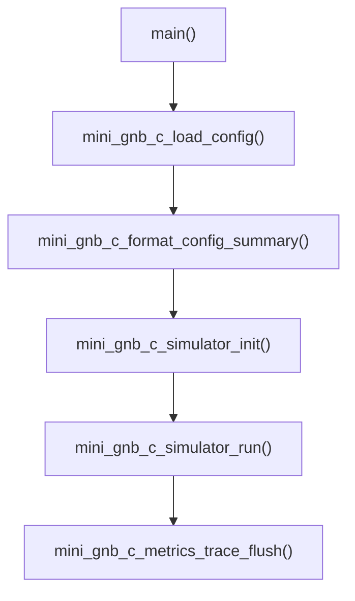
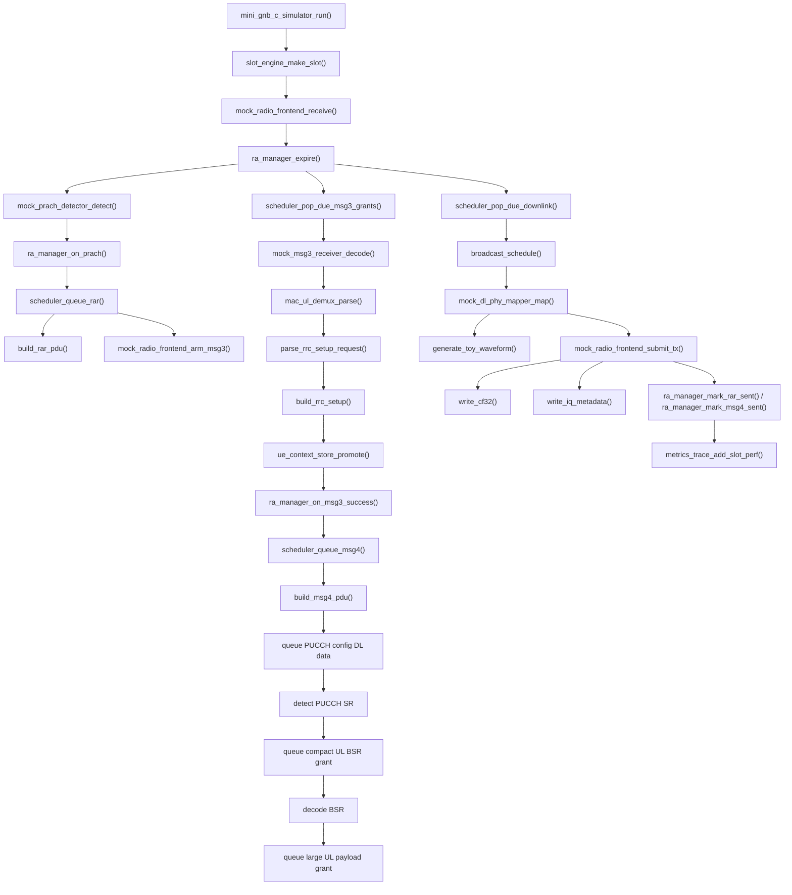
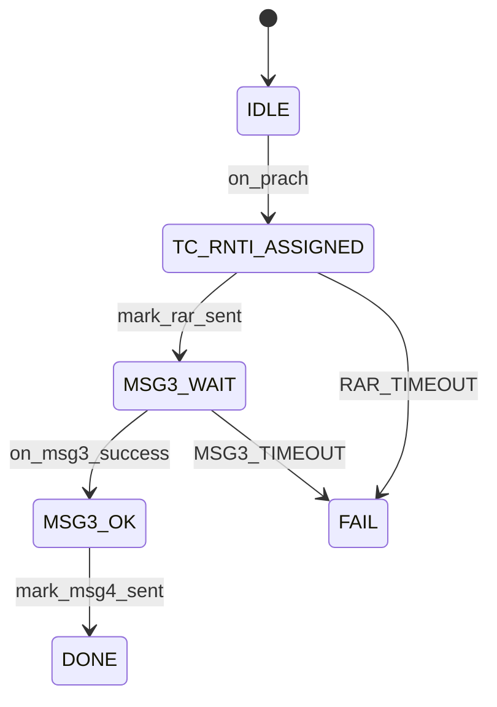

# gnb_c Architecture

## 1. Overview

`gnb_c` is a C implementation of the minimal gNB prototype in this repository.

Its design target is:

- single process
- single thread
- single cell
- single UE
- mock PHY/RF
- initial access closure from Msg1 to Msg4

It is not designed as a production gNB. Instead, it is a small bring-up baseline that keeps the same logical decomposition as a gNB:

- configuration
- timing
- broadcast
- random access
- uplink decode
- MAC/RRC parsing
- downlink scheduling
- PHY mapping
- radio output
- metrics and trace

The most important architectural feature is:

**the whole system is slot-driven by one top-level simulator loop.**

There are no threads, no locks, and no asynchronous queues in the current implementation.

For the current implementation status and the concrete validation commands used to
exercise the UE/gNB/core path, see:

- `feature_test_guide.md`

## 2. Top-Level Shape

The entrypoint is:

- `apps/mini_gnb_c_sim.c`
- `apps/ngap_probe.c`

The top-level composition root is:

- `include/mini_gnb_c/common/simulator.h`

The main control loop is:

- `src/common/simulator.c`

The simulator object directly owns all major modules:

- `config`
- `metrics`
- `slot_engine`
- `radio`
- `broadcast`
- `prach_detector`
- `ra_manager`
- `scheduler`
- `msg3_receiver`
- `dl_mapper`
- `ue_store`

So the code architecture is a **composition-based modular design**, not inheritance and not callback-driven orchestration.

`apps/ngap_probe.c` is intentionally separate from the slot-driven simulator. It is a
small external-system validation tool for Open5GS bring-up:

- default mode
  - one-shot `NGSetupRequest` probe for basic N2 SCTP/NGAP reachability
- replay mode
  - follows the same N2 attach/session step order as `examples/gnb_ngap.pcap`
  - dynamically encodes every gNB-originated uplink NGAP message instead of copying uplink frames
  - generates the runtime-sensitive UE NAS messages from the AMF challenge
  - recomputes protected NAS MACs after `SecurityModeCommand`
  - treats `examples/gnb_ngap.pcap` as an optional reference capture for alignment and comparison
  - parses top-level `NAS-PDU` and session-level transfer data through bounded IE decoding
  - extracts session-level N3 parameters from `PDUSessionResourceSetupRequest`
  - validates N3 reachability with a GTP-U `Echo Request` to the configured or parsed UPF
  - emits one minimal session G-PDU using the parsed UL TEID, QFI, and UE IPv4
  - writes runtime trace pcaps for later NGAP and GTP-U inspection
  - keeps the checked-in reference captures under `examples/`, including `examples/gnb_ngap.pcap`
    and `examples/gnb_mac.pcap`

The probe started as a single-file bring-up tool, but the current implementation is
now being split into reusable support modules so the simulator can later share the
same core/session and N3 code paths:

- `core/core_session`
  - owns single-UE AMF/session/N3 state such as identifiers, counters, UPF tunnel, QFI, and UE IPv4
- `ngap/ngap_runtime`
  - builds the minimal reusable NGAP requests and responses needed by the Open5GS flow
  - parses AMF UE NGAP ID, `NAS-PDU`, and Open5GS user-plane session data from NGAP messages
- `ngap/ngap_transport`
  - owns the reusable SCTP transport wrapper for simulator-side AMF connectivity
  - supports injected transport ops so bridge tests can run without a live AMF
- `n3/gtpu_tunnel`
  - builds and validates the minimal GTP-U Echo and UL G-PDU packets used by replay mode

`apps/ngap_probe.c` now consumes the extracted `ngap/ngap_runtime` helpers instead
of owning those builders and Open5GS session parsers inline. That keeps the replay
tool usable while moving the future gNB core-bridge entrypoints into `mini_gnb_c_lib`.

The next local-loop milestone also needs a filesystem-backed exchange between the
future UE helper process and the simulator. The first version of that transport now
exists as:

- `link/json_link`
  - builds stable JSON event filenames
  - writes event envelopes with `tmp + rename` atomicity
  - is intended for low-rate local control/data event exchange, not high-throughput user-plane traffic

On top of that transport, the first UE-side process now exists:

- `ue/mini_ue_fsm`
  - generates the deterministic single-UE event plan used for the local filesystem workflow
  - currently assumes the same fixed timing as the mock gNB:
    - `PRACH`
    - `MSG3`
    - post-Msg4 `PUCCH_SR`
    - scheduled `BSR`
    - scheduled UL `DATA`
- `apps/mini_ue_c.c`
  - loads the YAML config
  - resolves `sim.local_exchange_dir`
  - emits the UE event sequence into `ue_to_gnb/`

That filesystem-backed path is now connected end-to-end inside the simulator:

- `radio/mock_radio_frontend`
  - resolves `sim.local_exchange_dir/ue_to_gnb`
  - consumes ordered `seq_<nnnnnn>_ue_*.json` envelopes
  - maps `PRACH`, `MSG3`, `PUCCH_SR`, `BSR`, and `DATA` into the existing uplink burst representation
  - keeps the existing slot-input text transport as a lower-priority fallback for tests and manual bring-up
  - suppresses the synthetic single-UE injection when local exchange mode is active so the UE process drives the slot loop

So the current local bring-up path is:

1. `apps/mini_ue_c.c` writes the deterministic single-UE event plan into `ue_to_gnb/`
2. `radio/mock_radio_frontend` consumes those events slot by slot
3. `src/common/simulator.c` runs the unchanged RA, MAC, scheduler, and metrics flow on top of the consumed bursts
4. `tests/test_integration.c:test_integration_local_exchange_ue_plan()` verifies the full PRACH, Msg3, SR, BSR, and UL DATA path without handcrafted slot input files

To prepare the next AMF/session integration stage, the promoted UE state now also
owns an embedded core-session object:

- `common/types.h`
  - `mini_gnb_c_ue_context_t` now embeds `mini_gnb_c_core_session_t`
- `ue/ue_context_store`
  - seeds that embedded session with the promoted `C-RNTI`
  - leaves NGAP/session/N3 identifiers empty until the bridge starts populating them
- `metrics/metrics_trace`
  - exports the embedded `core_session` object in `summary.json`
  - keeps unresolved fields as `null`, so the summary schema is already stable before the bridge is live
- `tests/test_ue_context_store.c`
  - verifies that UE promotion initializes the embedded bridge state cleanly

The first live simulator-side core bridge is now wired on top of that state:

- `core/gnb_core_bridge`
  - owns the single-UE gNB-to-AMF bridge runtime
  - seeds `ran_ue_ngap_id` from `core.ran_ue_ngap_id_base`
  - seeds the requested `pdu_session_id`
  - opens the reusable `ngap/ngap_transport` SCTP transport to the configured AMF
  - completes one `NGSetupRequest -> NGSetupResponse` handshake
  - sends one reusable `InitialUEMessage` through `ngap/ngap_runtime`
  - parses the first `AMF UE NGAP ID` and `NAS-PDU` returned by the AMF
  - increments the UE-side uplink/downlink NAS counters once that first exchange completes
  - emits the first `DL_NAS` event into `sim.local_exchange_dir/gnb_to_ue/` when the local filesystem workflow is enabled
  - then polls `sim.local_exchange_dir/ue_to_gnb_nas/` for due `UL_NAS` events and relays them as `UplinkNASTransport`
  - emits each returned follow-up AMF `NAS-PDU` back into `gnb_to_ue/`
  - recognizes `InitialContextSetupRequest` and `PDUSessionResourceSetupRequest` from the AMF
  - sends `InitialContextSetupResponse` and `PDUSessionResourceSetupResponse` without leaving the slot-driven simulator model
  - parses Open5GS user-plane session state from `PDUSessionResourceSetupRequest` and writes it into the embedded `core_session`
- `config/default_cell.yml`
  - now includes an optional `core:` section
  - the section now also carries a `timeout_ms` setting for the SCTP bridge
  - the bridge is disabled by default so older local-loop runs do not change behavior
- `src/common/simulator.c`
  - invokes the bridge immediately after `ue_context_store` promotion
  - polls the bridge once per slot for due follow-up `UL_NAS` control-plane events
  - keeps the bridge outcome inside the embedded `core_session`, so the summary schema stays aligned with the future live AMF bridge

This is now a minimal live control-plane bridge covering the first NAS hop plus the
follow-up session-setup acknowledgements needed by the Open5GS attach flow.
The simulator can bring up SCTP + NGAP to the AMF, surface the first AMF NAS
downlink into the local UE exchange directory, and relay later filesystem-backed
`UL_NAS` events into follow-up `UplinkNASTransport` exchanges. It can also parse
later PDU-session user-plane state inside the simulator path and send the required
gNB-side NGAP acknowledgements. It still does not yet drive the full UE NAS state
machine automatically.

So `ngap_probe` is not part of the radio simulator loop. It is a protocol bring-up
tool that shares the same repository because it validates the external Open5GS
integration path that the prototype gNB is expected to use.

## 3. Directory Layout

- `apps/`
  - executable entrypoint
- `config/`
  - static YAML configuration
- `include/mini_gnb_c/`
  - public headers grouped by subsystem
- `src/`
  - subsystem implementations
- `tests/`
  - unit tests and integration test

Subsystem mapping:

- `config`
  - config loading and summary formatting
- `timing`
  - slot generation and frame timing abstraction
- `broadcast`
  - SSB and SIB1 scheduling and payload generation
- `ra`
  - RA state machine
- `scheduler`
  - pending RAR, Msg3 UL grants, Msg4 DL grants, post-attach DL/UL grants
- `phy_ul`
  - mock PRACH detect and mock Msg3 decode
- `mac`
  - Msg3 MAC PDU demux
- `rrc`
  - minimal RRC CCCH parser/builder
- `core`
  - reusable single-UE session state for AMF/N3 integration
- `link`
  - reusable local JSON exchange helpers for the future UE/gNB filesystem bridge
- `n3`
  - reusable GTP-U packet builders and validators
- `ue`
  - minimal UE-side FSM and context helpers for the local-loop bring-up path
- `phy_dl`
  - toy DL waveform mapping
- `radio`
  - mock RX/TX and IQ export
- `ue`
  - minimal UE context store
- `metrics`
  - trace, counters, performance metrics, summary files

## 4. Main Startup Path

The startup path is short and explicit:

1. `main()` in `apps/mini_gnb_c_sim.c`
2. `mini_gnb_c_load_config()`
3. `mini_gnb_c_format_config_summary()`
4. `mini_gnb_c_simulator_init()`
5. `mini_gnb_c_simulator_run()`

This means the program has two top-level phases:

- initialization
- slot-by-slot execution

### 4.1 Startup Call Graph

## 5. Core Runtime Model

The runtime model is:

- one loop over `abs_slot`
- each slot is converted to `sfn.slot`
- every subsystem is driven synchronously from that slot

This is implemented in:

- `src/common/simulator.c`

The slot loop performs:

1. create slot context
2. receive UL radio burst from local exchange JSON events, slot input files, or mock injection
3. expire old RA context if needed
4. detect PRACH from the received UL burst
5. create and queue RAR if PRACH exists
6. arm the expected Msg3 slot in the mock radio
7. pop due Msg3 UL grants
8. decode Msg3 only if a UL burst arrives at the granted slot
9. MAC demux
10. parse RRCSetupRequest
11. build RRCSetup
12. promote UE context
13. schedule Msg4
14. after Msg4, queue a mock `PUCCH` config on `DCI1_1 + PDSCH`
15. detect `PUCCH SR` and queue a compact `DCI0_1` grant for `BSR`
16. decode the granted `BSR` and queue a larger `DCI0_1` grant for UL payload
17. process optional scripted connected scheduling controls for the current slot
18. pop due scheduled UL data receptions
19. pop due UL data grants and export standalone `DCI0_1`
20. pop due DL grants
21. add broadcast grants
22. attach companion PDCCH/DCI metadata to scheduled PDSCH objects
23. map DL grants into patches and IQ samples
24. submit TX and export IQ / text transport / companion PDCCH text
25. mark RAR sent, Msg4 sent, or DL data sent
26. collect slot performance
27. flush summary after loop end

## 6. Main Execution Flow

### 6.1 Overall Flow

### 6.2 Msg1 to Msg4 Logic

The current implementation models the access procedure as:

- Msg1
  - mock radio receives a PRACH burst either from `slot_<abs_slot>_UL_OBJ_PRACH.txt`
    or `slot_<abs_slot>_UL_OBJ_PRACH.cf32`, or from the synthetic PRACH injector
  - PRACH detector extracts a `PrachIndication`
- Msg2
  - RAR build and scheduling
  - companion PDCCH export for the scheduled PDSCH object
- Msg3
  - Msg2 decides the expected Msg3 slot through `msg3_delay_slots`
  - mock radio receives a Msg3 burst either from `slot_<abs_slot>_UL_OBJ_MSG3.txt`
    or `slot_<abs_slot>_UL_OBJ_MSG3.cf32`, or from the synthetic grant-driven injector
  - if no burst arrives, the RA context eventually times out and the next PRACH can start a fresh attempt
  - mock PUSCH/UL-SCH decode from the received UL burst
  - MAC parse
  - RRCSetupRequest parse
- Msg4
  - build contention resolution identity + RRCSetup
  - schedule DL object and companion PDCCH metadata, then transmit
- Connected follow-up
  - default mode keeps the simple built-in chain:
    - queue one mock downlink `DATA` transmission with `DCI1_1 + PDSCH` carrying a `PUCCH` config string
    - detect one mock UE `UL_OBJ_PUCCH_SR` burst
    - queue one compact uplink `BSR` grant with standalone `DCI0_1`
    - decode one text `BSR|bytes=...` payload from the UE
    - queue one larger uplink `DATA` grant with standalone `DCI0_1`
    - receive one mock UE `UL_OBJ_DATA` burst on that larger grant
  - scripted mode can replace that chain with:
    - direct per-slot `SCRIPT_DL` / `SCRIPT_UL` plan files
    - or handcrafted `SCRIPT_PDCCH_DL` / `SCRIPT_PDCCH_UL` files that drive the later PDSCH/PUSCH expectations

## 7. Key Data Structures

Most important shared types are defined in:

- `include/mini_gnb_c/common/types.h`

### 7.1 Configuration Types

- `mini_gnb_c_cell_config_t`
- `mini_gnb_c_prach_config_t`
- `mini_gnb_c_rf_config_t`
- `mini_gnb_c_broadcast_config_t`
- `mini_gnb_c_sim_config_t`
- `mini_gnb_c_config_t`

These are loaded once at startup by:

- `mini_gnb_c_load_config()`

### 7.2 Runtime Context Types

- `mini_gnb_c_slot_indication_t`
  - current slot abstraction
- `mini_gnb_c_prach_indication_t`
  - PRACH detection result
- `mini_gnb_c_radio_burst_t`
  - UL burst returned by the mock radio, including type, samples, and optional Msg3 MAC PDU
- `mini_gnb_c_ul_grant_for_msg3_t`
  - Msg3 UL scheduling info
- `mini_gnb_c_pdcch_dci_t`
  - minimal mock PDCCH/DCI scheduling metadata
- `mini_gnb_c_dl_grant_t`
  - DL object scheduling info plus optional companion PDCCH metadata
- `mini_gnb_c_msg3_decode_indication_t`
  - Msg3 decode result
- `mini_gnb_c_mac_ul_parse_result_t`
  - decoded MAC subPDU structure
- `mini_gnb_c_rrc_setup_request_info_t`
  - parsed RRCSetupRequest fields
- `mini_gnb_c_rrc_setup_blob_t`
  - encoded RRCSetup payload
- `mini_gnb_c_ra_context_t`
  - active RA state
- `mini_gnb_c_ue_context_t`
  - promoted UE context
- `mini_gnb_c_tx_grid_patch_t`
  - DL PHY patch with toy waveform samples
- `mini_gnb_c_run_summary_t`
  - final execution summary

### 7.3 Why These Types Matter

The system passes these structs from module to module instead of using hidden global state.

That gives the implementation three good properties:

- explicit data flow
- easy testing
- clear ownership boundaries

### 7.4 Recent Scheduling Extensions

The recent connected-mode testability update adds three architectural pieces:

- `mini_gnb_c_sim_config_t`
  - now includes `scripted_schedule_dir` and `scripted_pdcch_dir`
  - these optional directories let the simulator replace the built-in post-Msg4 scheduling path with slot-scoped plan files
- `mini_gnb_c_dl_data_schedule_request_t`
  - now carries `prb_start`, `prb_len`, `mcs`, and `dci_format`
  - this lets direct scripted scheduling choose the exact companion `PDCCH` metadata and the resulting `tbsize`
- `mini_gnb_c_lookup_tbsize(prb_len, mcs)`
  - now centralizes a small `PRB x MCS -> tbsize` lookup table in `src/common/types.c`
  - both DL export and UL grant/export paths use the same mapping, so `tbsize` stays consistent in `DL_OBJ_DATA.txt`, `DL_OBJ_PDCCH.txt`, and `UL_OBJ_DATA.txt`

## 8. Module Responsibilities

### 8.1 Config Layer

Files:

- `src/config/config_loader.c`

Key functions:

- `mini_gnb_c_load_config()`
- `mini_gnb_c_format_config_summary()`

Responsibility:

- load static YAML
- fill `mini_gnb_c_config_t`
- format startup summary text

This layer is read-only after startup.

### 8.2 Timing Layer

Files:

- `src/timing/slot_engine.c`

Key functions:

- `mini_gnb_c_slot_engine_init()`
- `mini_gnb_c_slot_engine_make_slot()`

Responsibility:

- map `abs_slot` to `sfn.slot`
- generate slot timing fields
- mark whether the slot has SSB, SIB1, PRACH opportunity

This is the heartbeat of the whole prototype.

### 8.3 Broadcast Layer

Files:

- `src/broadcast/broadcast_engine.c`

Key functions:

- `mini_gnb_c_broadcast_engine_init()`
- `mini_gnb_c_broadcast_schedule()`
- `mini_gnb_c_build_mib()`
- `mini_gnb_c_build_sib1()`

Responsibility:

- generate MIB-like payload text
- generate SIB1-like payload text
- insert SSB and SIB1 into current DL schedule
- attach mock `DCI1_0` metadata for SIB1 because it is carried on scheduled PDSCH

Current SIB1 timing model:

- `sib1_period_slots`
- `sib1_offset_slot`

The resulting send slots are:

- `abs_slot = sib1_offset_slot + k * sib1_period_slots`

### 8.4 PRACH Detection Layer

Files:

- `src/phy_ul/mock_prach_detector.c`

Key functions:

- `mini_gnb_c_mock_prach_detector_init()`
- `mini_gnb_c_mock_prach_detector_detect()`

Responsibility:

- inspect the current UL burst returned by the mock radio
- emit `PrachIndication` only when the burst type is `UL_BURST_PRACH`

This means PRACH is no longer triggered directly by the slot loop.

### 8.5 RA State Machine

Files:

- `src/ra/ra_manager.c`

Key functions:

- `mini_gnb_c_ra_manager_init()`
- `mini_gnb_c_ra_manager_on_prach()`
- `mini_gnb_c_ra_manager_mark_rar_sent()`
- `mini_gnb_c_ra_manager_on_msg3_success()`
- `mini_gnb_c_ra_manager_mark_msg4_sent()`
- `mini_gnb_c_ra_manager_expire()`

Responsibility:

- own the single active RA context
- allocate `tc_rnti`
- derive `rar_abs_slot`
- derive `msg3_expect_abs_slot`
- derive `msg4_abs_slot`
- track RA state transitions
- detect RAR timeout and Msg3 timeout

This is the control core of the access flow.

### 8.6 Initial Access Scheduler

Files:

- `src/scheduler/initial_access_scheduler.c`

Key functions:

- `mini_gnb_c_initial_access_scheduler_init()`
- `mini_gnb_c_initial_access_scheduler_queue_rar()`
- `mini_gnb_c_initial_access_scheduler_queue_msg4()`
- `mini_gnb_c_initial_access_scheduler_pop_due_downlink()`
- `mini_gnb_c_initial_access_scheduler_pop_due_msg3_grants()`

Responsibility:

- keep pending DL objects
- keep pending Msg3 UL grants
- keep pending UL data grants and UL data receive expectations
- convert RA requests into scheduled objects
- build RAR via `mini_gnb_c_build_rar_pdu()`
- build Msg4 via `mini_gnb_c_build_msg4_pdu()`
- attach companion mock PDCCH metadata for scheduled DL objects

This is intentionally not a generic scheduler. It only supports:

- RAR
- Msg3 UL grant
- Msg4
- one post-Msg4 downlink `DATA` grant for `PUCCH` config
- one compact post-Msg4 uplink `BSR` grant
- one larger post-Msg4 uplink `DATA` grant
- companion PDCCH metadata for those DL objects

### 8.6.1 Scripted Connected Scheduling Hooks

To make post-Msg4 behavior controllable for state-machine tests and upper-layer
flow validation, `src/common/simulator.c` now adds a scripted control hook before
the scheduler pops due connected-mode grants.

That hook reads one optional file per slot from either:

- `sim.scripted_schedule_dir`
  - direct scheduling mode
  - `slot_<abs_slot>_SCRIPT_DL.txt` directly queues a DL `DATA` object
  - `slot_<abs_slot>_SCRIPT_UL.txt` directly queues a UL grant / receive expectation
- `sim.scripted_pdcch_dir`
  - PDCCH-driven mode
  - `slot_<abs_slot>_SCRIPT_PDCCH_DL.txt` injects handcrafted DL `DCI1_x` metadata and derives the later `PDSCH`
  - `slot_<abs_slot>_SCRIPT_PDCCH_UL.txt` injects handcrafted UL `DCI0_x` metadata and derives the later `PUSCH` expectation

When either directory is configured:

- the built-in post-Msg4 `PUCCH SR -> BSR -> large UL DATA` chain is disabled
- the scripted files become the only source of connected-mode grants
- the UE context summary is updated with the scripted DL slot and UL grant slots so integration tests can assert the intended plan directly

### 8.7 Msg3 Receiver

Files:

- `src/phy_ul/mock_msg3_receiver.c`

Key functions:

- `mini_gnb_c_mock_msg3_receiver_init()`
- `mini_gnb_c_mock_msg3_receiver_decode()`

Responsibility:

- create a simulated Msg3 MAC PDU
- decode Msg3 only when the current slot has both:
  - a due Msg3 UL grant
  - a UL burst of type `UL_BURST_MSG3`
- carry CRC, SNR, EVM, and MAC PDU from the received burst

This is the current substitute for real PUSCH/UL-SCH decoding.

The simulator also contains a minimal scheduled UL decode path for
`UL_BURST_PUCCH_SR` and `UL_BURST_DATA`. `BSR` is parsed as a text payload
(`BSR|bytes=...`), while the larger UL payload remains intentionally opaque and
does not run full MAC parsing.

### 8.8 MAC UL Demux

Files:

- `src/mac/mac_ul_demux.c`

Key function:

- `mini_gnb_c_mac_ul_demux_parse()`

Responsibility:

- parse Msg3 MAC PDU subheaders
- identify C-RNTI CE
- identify UL-CCCH SDU
- track LCID sequence

### 8.9 RRC CCCH Stub

Files:

- `src/rrc/rrc_ccch_stub.c`

Key functions:

- `mini_gnb_c_parse_rrc_setup_request()`
- `mini_gnb_c_build_rrc_setup()`

Responsibility:

- parse `RRCSetupRequest`
- build a minimal `RRCSetup`

This is intentionally only a thin shell.

### 8.10 UE Context Store

Files:

- `src/ue/ue_context_store.c`

Key functions:

- `mini_gnb_c_ue_context_store_init()`
- `mini_gnb_c_ue_context_store_promote()`
- `mini_gnb_c_ue_context_store_mark_rrc_setup_sent()`

Responsibility:

- create minimal UE context only after Msg3 success
- copy contention identity into UE context
- mark when Msg4 was sent

The implementation deliberately follows the design choice:

**do not create a formal UE context at Msg1. Promote only after Msg3 is valid.**

### 8.11 DL PHY Mapper

Files:

- `src/phy_dl/mock_dl_phy_mapper.c`

Key functions:

- `mini_gnb_c_mock_dl_phy_mapper_init()`
- `mini_gnb_c_mock_dl_phy_mapper_map()`
- `mini_gnb_c_generate_toy_waveform()`

Responsibility:

- convert DL grants into `mini_gnb_c_tx_grid_patch_t`
- fill metadata such as PRB, symbol span, object type
- carry companion PDCCH/DCI metadata forward to the radio export layer
- generate a toy OFDM-like waveform
- store complex samples into patch buffers

This is not full NR baseband generation. It is a minimal mock physical waveform pipeline.

### 8.12 Radio Layer

Files:

- `src/radio/mock_radio_frontend.c`

Key functions:

- `mini_gnb_c_mock_radio_frontend_init()`
- `mini_gnb_c_mock_radio_frontend_receive()`
- `mini_gnb_c_mock_radio_frontend_submit_tx()`
- `mini_gnb_c_write_transport_text()`
- `mini_gnb_c_write_cf32()`
- `mini_gnb_c_write_iq_metadata()`

Responsibility:

- simulate RX timestamp input
- optionally read slot-driven UL bursts from `sim.ul_input_dir`
  using text files first and `.cf32` as fallback
- otherwise inject initial PRACH and grant-driven Msg3 UL bursts
- optionally retry with a new PRACH burst after Msg3 is missing
- parse UL control fields, `PUCCH_SR`, and Msg3/BSR/data payloads from text transport files
- accept DL patches
- export DL scheduling and payload as text transport files
- export companion `PDCCH/DCI` text files for scheduled PDSCH objects
- count TX bursts
- export `.cf32` IQ files
- export sidecar `.json` metadata

The radio layer is where:

- downlink toy waveforms become file artifacts
- uplink mock RF data enters the simulator

### 8.13 Metrics Layer

Files:

- `src/metrics/metrics_trace.c`

Key functions:

- `mini_gnb_c_metrics_trace_init()`
- `mini_gnb_c_metrics_trace_increment_named()`
- `mini_gnb_c_metrics_trace_event()`
- `mini_gnb_c_metrics_trace_add_slot_perf()`
- `mini_gnb_c_metrics_trace_flush()`

Responsibility:

- counters
- structured trace events
- slot performance records
- summary export
- JSON output files

Produced artifacts:

- `out/trace.json`
- `out/metrics.json`
- `out/summary.json`

## 9. Detailed Function Call Relationships

### 9.1 Initialization Relationships

`mini_gnb_c_simulator_init()` calls:

- `mini_gnb_c_metrics_trace_init()`
- `mini_gnb_c_slot_engine_init()`
- `mini_gnb_c_mock_radio_frontend_init()`
- `mini_gnb_c_broadcast_engine_init()`
- `mini_gnb_c_mock_prach_detector_init()`
- `mini_gnb_c_ra_manager_init()`
- `mini_gnb_c_initial_access_scheduler_init()`
- `mini_gnb_c_mock_msg3_receiver_init()`
- `mini_gnb_c_mock_dl_phy_mapper_init()`
- `mini_gnb_c_ue_context_store_init()`

### 9.2 PRACH to RAR Relationships

Inside one slot:

1. `mini_gnb_c_mock_prach_detector_detect()`
2. `mini_gnb_c_ra_manager_on_prach()`
3. `mini_gnb_c_initial_access_scheduler_queue_rar()`
4. `mini_gnb_c_build_rar_pdu()`
5. `mini_gnb_c_mock_radio_frontend_arm_msg3()`

Meaning:

- radio provides a PRACH burst
- detector finds Msg1 from that burst
- RA manager creates state
- scheduler creates Msg2 and Msg3 UL grant
- builder serializes RAR payload
- radio is armed to expect Msg3 at the granted slot

### 9.3 Msg3 to Msg4 Relationships

1. `mini_gnb_c_initial_access_scheduler_pop_due_msg3_grants()`
2. `mini_gnb_c_mock_msg3_receiver_decode()`
3. `mini_gnb_c_mac_ul_demux_parse()`
4. `mini_gnb_c_parse_rrc_setup_request()`
5. `mini_gnb_c_build_rrc_setup()`
6. `mini_gnb_c_ue_context_store_promote()`
7. `mini_gnb_c_ra_manager_on_msg3_success()`
8. `mini_gnb_c_initial_access_scheduler_queue_msg4()`
9. `mini_gnb_c_build_msg4_pdu()`

Meaning:

- Msg3 grant and the current UL burst together become a decoded MAC payload
- MAC payload becomes CCCH message
- CCCH message becomes request info
- request info becomes RRCSetup
- RA context becomes UE context
- RA manager decides Msg4 slot
- scheduler stores Msg4 DL object

### 9.4 DL Transmission Relationships

1. `mini_gnb_c_initial_access_scheduler_pop_due_downlink()`
2. `mini_gnb_c_broadcast_schedule()`
3. `mini_gnb_c_mock_dl_phy_mapper_map()`
4. `mini_gnb_c_generate_toy_waveform()`
5. `mini_gnb_c_mock_radio_frontend_submit_tx()`
6. `mini_gnb_c_write_cf32()`
7. `mini_gnb_c_write_iq_metadata()`

Meaning:

- all DL objects due in current slot are gathered
- broadcast objects are appended
- scheduled PDSCH-like objects already carry companion PDCCH/DCI metadata
- DL objects are mapped into transmission patches
- toy waveform is synthesized
- radio layer exports IQ files and companion PDCCH text files

### 9.5 Post-TX State Updates

After transmit:

- `mini_gnb_c_ra_manager_mark_rar_sent()`
- `mini_gnb_c_ra_manager_mark_msg4_sent()`
- `mini_gnb_c_ue_context_store_mark_rrc_setup_sent()`

Meaning:

- state changes are tied to actual scheduled transmit pass

## 10. Random Access State Machine

The active RA context is stored in:

- `mini_gnb_c_ra_manager_t.active_context`

State progression:

Important design rule:

- only one active RA context exists
- only one UE context exists
- RA context is promoted into UE context after Msg3 success

## 11. Broadcast and Access Scheduling Model

The current scheduler model is intentionally narrow.

Broadcast path:

- SSB generated from slot periodicity, without PDCCH because it models PBCH/MIB
- SIB1 generated from `period + offset`, with companion mock `DCI1_0`

Access path:

- PRACH creates RAR + Msg3 UL grant
- RAR is exported as PDSCH with companion mock `DCI1_0`
- if `sim.ul_input_dir` exists, the radio checks `slot_<abs_slot>_UL_OBJ_PRACH.txt`
  / `slot_<abs_slot>_UL_OBJ_MSG3.txt` / `slot_<abs_slot>_UL_OBJ_PUCCH_SR.txt`
  / `slot_<abs_slot>_UL_OBJ_DATA.txt` first, then falls back to matching `.cf32` files;
  missing files mean empty UL input
- otherwise the mock radio only emits Msg3 if the grant is armed and `msg3_present=true`
- Msg3 miss can re-arm a future PRACH attempt
- Msg3 success creates Msg4
- Msg4 is exported as PDSCH with companion mock `DCI1_0`
- after Msg4, the prototype enters a tiny connected mode:
  - one DL data PDSCH with `DCI1_1` that carries a `PUCCH` config string
  - one UE `PUCCH_SR` burst
  - one compact UL `BSR` grant with standalone `DCI0_1`
  - one `BSR|bytes=...` burst from the UE
  - one larger UL `DATA` grant with standalone `DCI0_1`
  - one opaque UL data burst from the UE

This means the DL schedule for a slot is:

- pending access grants due now
- plus broadcast grants due now

There is no generic PRB conflict resolver, HARQ scheduler, or multi-UE arbitration.

## 12. IQ Export Architecture

The IQ export path is:

1. `mini_gnb_c_mock_dl_phy_mapper_map()`
2. `mini_gnb_c_generate_toy_waveform()`
3. `mini_gnb_c_mock_radio_frontend_submit_tx()`
4. `mini_gnb_c_write_cf32()`
5. `mini_gnb_c_write_iq_metadata()`

The actual sample container is:

- `mini_gnb_c_tx_grid_patch_t.samples`

Waveform properties:

- toy OFDM-like waveform
- fixed FFT size and CP length
- per-object waveform export
- one `.cf32` and one `.json` per DL object

Outputs go to:

- `out/iq/*.cf32`
- `out/iq/*.json`

This is useful for:

- waveform inspection
- offline plotting
- validation of scheduling and payload-to-waveform path

## 13. Why This Architecture Is Useful

This implementation is intentionally simple but still keeps good gNB engineering ideas:

- slot-driven execution
- RA context separated from UE context
- access control separated from scheduling
- MAC/RRC separated from PHY mapping
- observation as a first-class concern

The result is a codebase that is small enough to understand end-to-end, but already structured enough to grow later.

## 14. Current Limitations

The current `gnb_c` implementation does not include:

- multi-thread scheduling
- generic MAC scheduler
- real PRACH/PUSCH/PDSCH/PDCCH processing; current PDCCH is minimal metadata/text export only
- real USRP/UHD integration
- complete ASN.1 handling
- core network integration
- multi-UE support
- security and reconfiguration
- retransmissions and HARQ

So this code should be understood as:

**a minimal architecture and execution skeleton for initial access bring-up.**

## 15. Suggested Reading Order

If you want to read the code quickly, use this order:

1. `apps/mini_gnb_c_sim.c`
2. `include/mini_gnb_c/common/simulator.h`
3. `src/common/simulator.c`
4. `include/mini_gnb_c/common/types.h`
5. `src/ra/ra_manager.c`
6. `src/scheduler/initial_access_scheduler.c`
7. `src/phy_ul/mock_msg3_receiver.c`
8. `src/mac/mac_ul_demux.c`
9. `src/rrc/rrc_ccch_stub.c`
10. `src/phy_dl/mock_dl_phy_mapper.c`
11. `src/radio/mock_radio_frontend.c`
12. `src/metrics/metrics_trace.c`

That reading order matches the real execution path of the prototype.
